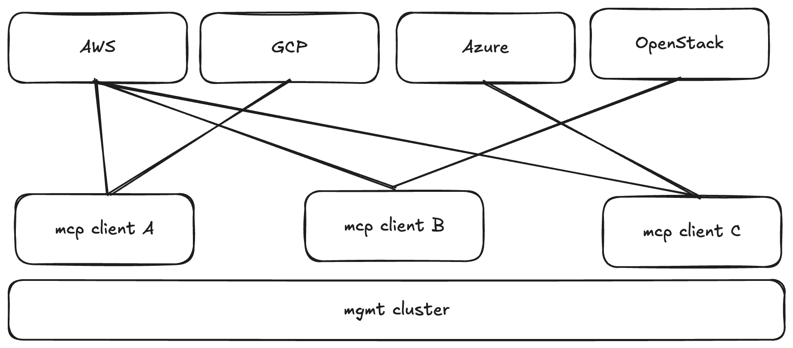
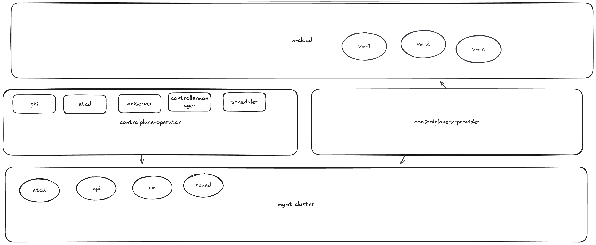

# Design

The **controlplane-operator** provides a unified Kubernetes API platform
with streamlined worker‑node deployment across any cloud or
infrastructure. Its goal is to offer a consistent, fully managed
control‑plane lifecycle while enabling easy and automated host
provisioning via pluggable provider backends.

# Architecture Overview

The architecture consists of:

1.  **Management Cluster** -- where the controlplane‑operator and
    provider operators run.
2.  **ControlPlane Instance** -- an aggregated Kubernetes API service
    that acts as the authoritative API server for the managed cluster.
3.  **controlplane‑x‑provider** -- a cloud‑specific API layer that
    listens for `Machine` and `NodePool` CRs and provisions hosts on the
    target infrastructure, enabling seamless host registration and
    onboarding.

Each ControlPlane instance includes:

-   **API controllers**: etcd, PKI, kube‑apiserver,
    kube‑controller‑manager, kube‑scheduler
    These components collectively deliver a standalone Kubernetes
    control plane running on the management cluster.

------------------------------------------------------------------------

# controlplane-operator

The controlplane‑operator manages the entire control plane lifecycle. It
includes:

### **PKI Controller**

-   Generates and rotates all required Kubernetes PKI assets.
-   Manages CA issuers and serving certificates.

### **ETCD Controller**

-   Deploys and manages the etcd cluster.
-   Handles backups, compaction, and restoration workflows.

### **APIServer Controller**

-   Deploys and maintains the managed kube‑apiserver.
-   Handles version upgrades, admission configuration, and HA.

### **ControllerManager Controller**

-   Manages the kube‑controller‑manager deployment.

### **Scheduler Controller**

-   Manages the kube‑scheduler deployment.

### **Addon Controller**

-   Installs and reconciles essential cluster addons:
    -   CNI
    -   CSI
    -   CoreDNS
    -   KubeProxy
-   Ensures these core components match cluster version and
    configuration.

------------------------------------------------------------------------

# controlplane-x-provider

Each provider implementation contains:

### **Machine Controller**

-   Provisions and manages VMs or hosts in the target cloud/environment.
-   Handles power, lifecycle, and health monitoring.

### **NodePool Controller**

-   Manages scaling groups / node pools.
-   Orchestrates host upgrades, reimages, and rolling updates.

### **Provider Addons**

-   Installs cloud‑specific integrations such as:
    -   Cloud Controller Manager (CCM)
    -   CSI plugins
    -   Provider metadata services
-   Manages OS image templates and ensures they embed correct join
    configuration for seamless node registration.

------------------------------------------------------------------------

# Operational Flow

### How it works:

1.  The **controlplane‑operator** and a **controlplane‑x‑provider** are
    deployed on the management cluster.
2.  A user creates a **ManagedControlPlane** CR, bootstrapping a
    dedicated Kubernetes API inside the management cluster.
3.  The user creates **Machine** or **NodePool** CRs that the provider
    uses to provision VMs in the target cloud.
4.  VMs boot using a provider‑managed controlplane image, automatically
    registering with the managed control plane.
5.  The provider installs required cloud‑specific addons (e.g., CCM,
    CSI) and ensures all provider integrations match the running
    environment.

This architecture provides a consistent, multi‑cloud control‑plane
experience with minimal operational overhead and automated node
onboarding.
